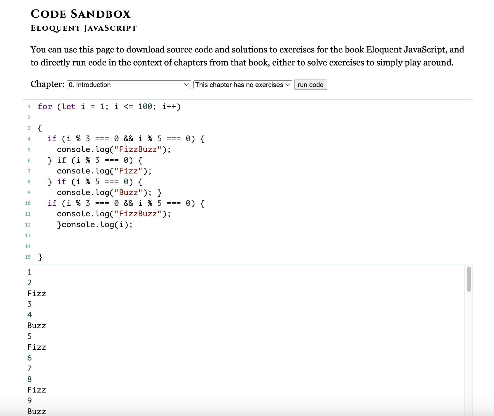
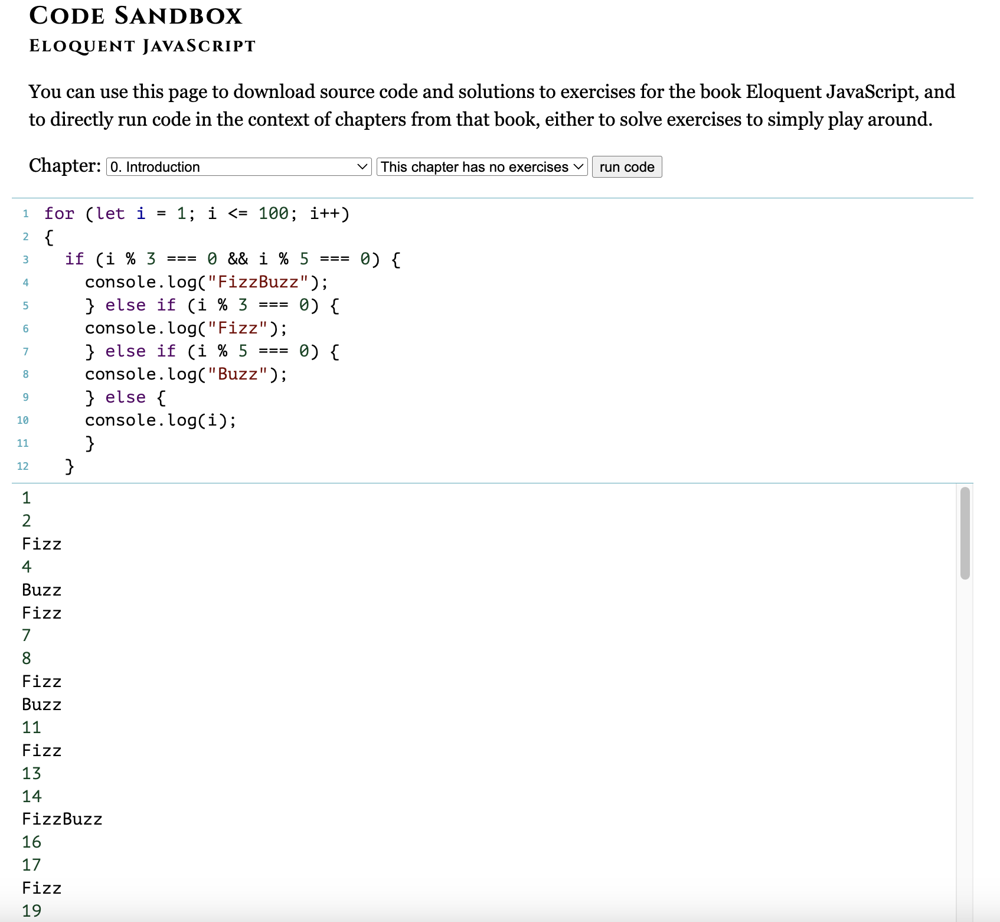

# FizzBuzz Homework

### First Code Tested

At first, I started trying right after class finished so that I could develop the code with the ideas being fresh in my mind. This is the first code I came with:


```for (let i = 1; i <= 100; i++) 
{
    if (i % 3 === 0) {
    console.log("Fizz");
  } if (i % 5 === 0) {
    console.log("Buzz"); }
  if (i % 3 === 0 && i % 5 === 0) {
    console.log("FizzBuzz");}
    {console.log(i);
  }
}
```

I tested the code in the sandbox (without expecting to be correct) and I figured out that the numbers were repeating:


### Second and Last Code

I then went back through the content of the class, specifically the "code along.js" file and remembered that the `else` keyword was very important so that it is one or the other value, but not both. I supposed that was the problem I was having with my code, so I changed the `if` for `else if` and the final one to `else` since it is the last one. Also, I noticed that in this case the order of the conditions were going to be important in comparison to the first code. That's why I moved the last condition: `if (i % 3 === 0 && i % 5 === 0) { console.log("FizzBuss"); }, to the first in line, because if not the first of either the two other conditions will make the computer stop searching for truthiness. 

I came up with the following code then:

```for (let i = 1; i <= 100; i++) 
{
  if (i % 3 === 0 && i % 5 === 0) {
    console.log("FizzBuzz");
    } else if (i % 3 === 0) {
    console.log("Fizz");
    } else if (i % 5 === 0) {
    console.log("Buzz"); 
    } else {
    console.log(i);
    }
  }
```
  
This one worked indeed and gave me the results that were asked:

