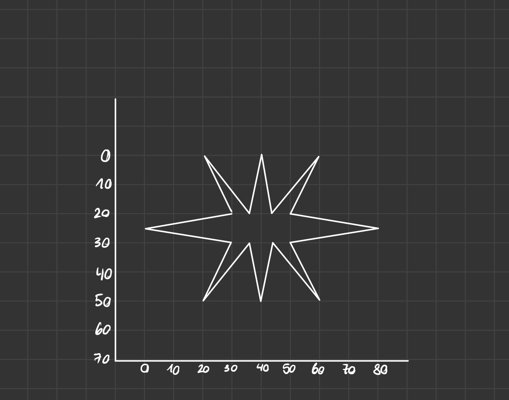
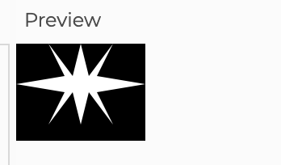
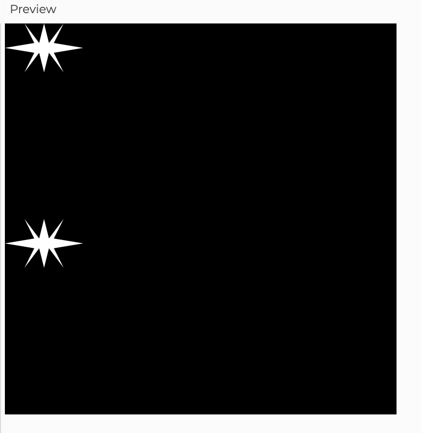
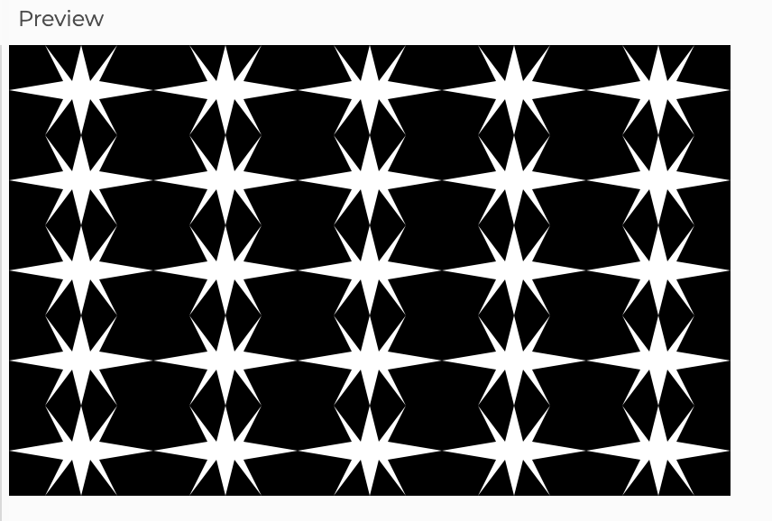
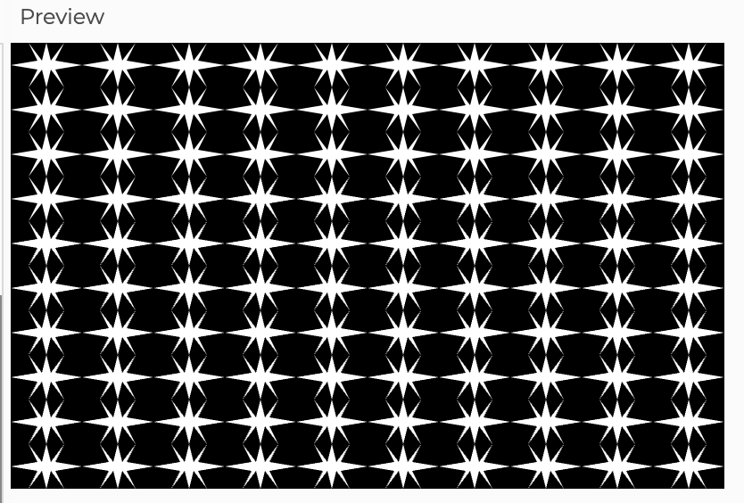
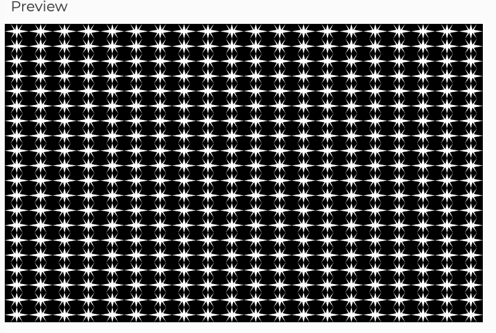

# Midterm

## Phase 1


## Phase 2

For this phase I pretty much followed the [Triangle p5.js Reference](https://p5js.org/reference/p5/triangle/) and the [Rectangle p5.js Reference](https://p5js.org/reference/p5/rect/)

```
function setup () {
  createCanvas (80, 60);
  noStroke();
}
  function draw () {
  background (0)
  fill(255); 
  triangle(0, 25, 30, 20, 30, 30)
  triangle(30, 20, 20, 0, 35, 20)
  triangle(35, 20, 40, 0, 45, 20)
  triangle(45, 20, 60, 0, 50, 20)
  triangle(80, 25, 50, 20, 50, 30)
  triangle(20, 50, 30, 30, 35, 30)
  triangle(35, 30, 40, 50, 45, 30)
  triangle(45, 30, 60, 50, 50, 30)
  rect(30, 20, 20, 10)
  }
```



## Phase 3
For the Phase 3, I pretty much followed the instructions on the Midterm instructions, so this phase was pretty straight forwards and didn't use any outside information.

#### First Code (not correct)
```
function setup () {
  createCanvas (400, 400);
  noStroke();
}
  function drawObject (x, y, s) {
  push();
  translate(x, y);
  scale(s);
  background (0)
  fill(255); 
  triangle(0, 25, 30, 20, 30, 30)
  triangle(30, 20, 20, 0, 35, 20)
  triangle(35, 20, 40, 0, 45, 20)
  triangle(45, 20, 60, 0, 50, 20)
  triangle(80, 25, 50, 20, 50, 30)
  triangle(20, 50, 30, 30, 35, 30)
  triangle(35, 30, 40, 50, 45, 30)
  triangle(45, 30, 60, 50, 50, 30)
  rect(30, 20, 20, 10)
  pop();
  }
function draw() {
  drawObject(0, 0, 1);
  drawObject(0, 200, 1);
}
```

Nevertheless, I noticed that the background was clearing the canvas each time, so I moved it down in the order of the code, because I still wanted the black background.

#### Final Code (Correct)

```
function setup () {
  createCanvas (400, 400);
  noStroke();
}
  function drawObject (x, y, s) {
  push();
  translate(x, y);
  scale(s);
  fill(255); 
  triangle(0, 25, 30, 20, 30, 30)
  triangle(30, 20, 20, 0, 35, 20)
  triangle(35, 20, 40, 0, 45, 20)
  triangle(45, 20, 60, 0, 50, 20)
  triangle(80, 25, 50, 20, 50, 30)
  triangle(20, 50, 30, 30, 35, 30)
  triangle(35, 30, 40, 50, 45, 30)
  triangle(45, 30, 60, 50, 50, 30)
  rect(30, 20, 20, 10)
  pop();
  }
function draw() {
    background (0)
  drawObject(0, 0, 1);
  drawObject(0, 200, 1);
}
```




## Phase 4

For the Phase 4, I went through the code along from the Functions class, and try to understand and use the nesting loop for this part. I had a difficult time trying to undersrtand how to have the adding number of the position correct, because I was only using the + sign. Then, I understood I had to sum up to the result of the last addition, that's why I end up using the += sign for this. The rest of it was more straight forwards because it was more similar to the example in class.

#### Code with for loop

```
function setup () {
  createCanvas (400, 400);
  noStroke();
}
  function drawObject (x, y, s) {
  push();
  translate(x, y);
  scale(s);
  fill(255); 
  triangle(0, 25, 30, 20, 30, 30)
  triangle(30, 20, 20, 0, 35, 20)
  triangle(35, 20, 40, 0, 45, 20)
  triangle(45, 20, 60, 0, 50, 20)
  triangle(80, 25, 50, 20, 50, 30)
  triangle(20, 50, 30, 30, 35, 30)
  triangle(35, 30, 40, 50, 45, 30)
  triangle(45, 30, 60, 50, 50, 30)
  rect(30, 20, 20, 10)
  pop();
  }
function draw() {
  background(0);
  for (let y = 0; y < 250; y += 50) 
    for (let x = 0; x < 400; x += 80) { 
      drawObject(x, y, 1);
  }
}
```

Nevertheless, then I noticed that we had to make the code assignable to the grid. So I knew this had to do with the scale so I mostly thought about it and got the conclusion that I just had to multiply the value of the position that was being added, to the scale.

#### Code with assignable grid

```
function setup () {
  createCanvas (400, 250);
  noStroke();
}
  function drawObject (x, y, s) {
  push();
  translate(x, y);
  scale(s);
  fill(255); 
  triangle(0, 25, 30, 20, 30, 30)
  triangle(30, 20, 20, 0, 35, 20)
  triangle(35, 20, 40, 0, 45, 20)
  triangle(45, 20, 60, 0, 50, 20)
  triangle(80, 25, 50, 20, 50, 30)
  triangle(20, 50, 30, 30, 35, 30)
  triangle(35, 30, 40, 50, 45, 30)
  triangle(45, 30, 60, 50, 50, 30)
  rect(30, 20, 20, 10)
  pop();
  }
function draw() {
  background(0);
    let s = 1
  for (let y = 0; y < 250; y += 50 * s) 
    for (let x = 0; x < 400; x += 80 * s) { 
      drawObject(x, y, s);
  }
}
```
Then I wanted it to be more easy to change the grid, so I found out that there is a function in p5.js that works when you press a key in the computer.
[Key Pressed Reference](https://p5js.org/reference/p5/keyPressed/)

#### Code with keyPressed function for assigning grid

```
function setup () {
  createCanvas (400, 250);
  noStroke();
}
  function drawObject (x, y, s) {
  push();
  translate(x, y);
  scale(s);
  fill(255); 
  triangle(0, 25, 30, 20, 30, 30)
  triangle(30, 20, 20, 0, 35, 20)
  triangle(35, 20, 40, 0, 45, 20)
  triangle(45, 20, 60, 0, 50, 20)
  triangle(80, 25, 50, 20, 50, 30)
  triangle(20, 50, 30, 30, 35, 30)
  triangle(35, 30, 40, 50, 45, 30)
  triangle(45, 30, 60, 50, 50, 30)
  rect(30, 20, 20, 10)
  pop();
  } 
let s = 1;
function draw() {
  background(0); 
  for (let y = 0; y < 250; y += 50 * s) 
    for (let x = 0; x < 400; x += 80 * s) { 
      drawObject(x, y, s);
  }
}
 function keyTyped () {
  if (key === '1') { s = 1;}
    else if (key === '2') {s = 0.5;}
	else if (key === '3') {s = 0.25;}
 }
```





After this, I thought it would be better if I simply had two keys so that it adds more tiles and anohter one that makes it have less tiles. Nevertheless, I wanted it to have a certain limit, so I assigned m for more tiles and l for less tiles just tweaking the definition of s. When we want more tiles, it would divide s by 2 `if (key === 'm') { s = (s / 2);` and when we wanted less tiles it would multiply it by 2 `else if (key === 'l') {s = (s * 2);`. Now for the limits, I just added `if` statements so that s doesn't pass the limits I wanted it to be within. 

#### Code with improved keyPressed function

```
function setup () {
  createCanvas (400, 250);
  noStroke();
}
  function drawObject (x, y, s) {
  push();
  translate(x, y);
  scale(s);
  fill(255); 
  triangle(0, 25, 30, 20, 30, 30)
  triangle(30, 20, 20, 0, 35, 20)
  triangle(35, 20, 40, 0, 45, 20)
  triangle(45, 20, 60, 0, 50, 20)
  triangle(80, 25, 50, 20, 50, 30)
  triangle(20, 50, 30, 30, 35, 30)
  triangle(35, 30, 40, 50, 45, 30)
  triangle(45, 30, 60, 50, 50, 30)
  rect(30, 20, 20, 10)
  pop();
  } 
let s = 1;
function draw() {
  background(0); 
  for (let y = 0; y < 250; y += 50 * s) 
    for (let x = 0; x < 400; x += 80 * s) { 
      drawObject(x, y, s);
  }
}
 function keyTyped () {
  if (key === 'm') { s = (s / 2);}
    else if (key === 'l') {s = (s * 2);}
  if (s > 1) s = 1;
  if (s < 0.1) s = 0.1;
 }
 ```